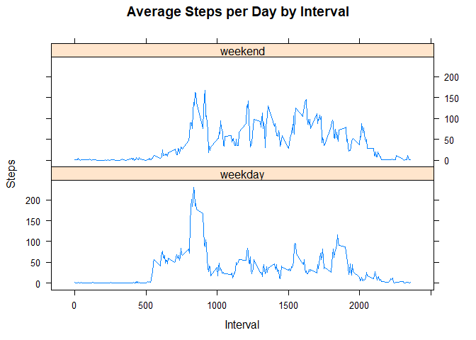

## Loading and preprocessing the data

I load the data and reformat the dates using lubridate.

```r
options(scipen=999)

data <- read.csv(unz("activity.zip","activity.csv"))
library(lubridate)
```

```
## 
## Attaching package: 'lubridate'
```

```
## The following object is masked from 'package:base':
## 
##     date
```

```r
data$date <- ymd(data$date)
```

## What is mean total number of steps taken per day?
Make a histogram of the total number of steps taken each day.


```r
library(ggplot2)
stepSum <- tapply(data$steps, data$date, sum, na.rm = TRUE)

qplot(stepSum,
      xlab = "Total Steps per Day",
      ylab = "Frequency @ bindwidth =3000",
      binwidth = 3000)
```

<!-- -->

```r
dailyStepMean <- round(mean(stepSum))
dailyStepMedian <- median(stepSum)
```

Mean steps per day: 9354

Median steps per day: 10395


## What is the average daily activity pattern?

```r
intMean <- tapply(data$steps, data$interval, mean, na.rm = TRUE)
df_int <- data.frame(interval=as.integer(names(intMean)), ave=intMean)

qplot(x = interval, y = ave, data = df_int,
      geom = "line",
      xlab = "Daily 5 minute intervals",
      ylab = "Average number of steps")
```

<!-- -->

```r
maxStep <- which.max(intMean)
```

The interval with the maximum steps (on average across all days) is 835 with an average of 104steps.


## Imputing missing values

```r
NAs <- nrow(data)-sum(complete.cases(data))
```

The total number of missing values are 2304

In order to check if these missing values are creating a bias we will impute their values by substituting the median for that interval. 


```r
dataImpute <- data
missing <- is.na(dataImpute$steps)
dataImpute$steps[missing] <- intMean[as.character(dataImpute$interval[missing])]

stepSum_impute <- tapply(dataImpute$steps, dataImpute$date, sum, na.rm = TRUE)

qplot(stepSum_impute,
      xlab = "Total Steps per Day",
      ylab = "Frequency @ bindwidth =3000",
      binwidth = 3000)
```

<!-- -->

```r
dailyStepMean_impute <- round(mean(stepSum_impute))
dailyStepMedian_impute <- round(median(stepSum_impute))

diffMean <- dailyStepMean_impute - dailyStepMean
diffMedian <- dailyStepMedian_impute - dailyStepMedian
```


Mean steps per day with imputed data are 10766, representing a 1412 with the non-imputed data. Median steps per day with imputed data are 10766, representing a 371 with the non-imputed data. The mean and median are now much closer, suggesting the distribution is more symmetrical.

The mean and the median are both shifted substantially to the right, suggesting that missing values were biasing the data downward. Graphically, we notice that there are much fewer days in the 0-3,000 step range, suggesting that several days in the original data had only partially missing values and therefore were inaccurately included in the low step bin. Thus, there NAs were causing a bias.


## Are there differences in activity patterns between weekdays and weekends?


```r
library(dplyr)
```

```
## 
## Attaching package: 'dplyr'
```

```
## The following objects are masked from 'package:lubridate':
## 
##     intersect, setdiff, union
```

```
## The following objects are masked from 'package:stats':
## 
##     filter, lag
```

```
## The following objects are masked from 'package:base':
## 
##     intersect, setdiff, setequal, union
```

```r
weekends <- c("Saturday","Sunday")
dataImpute$dow <- as.factor(ifelse(is.element(weekdays(dataImpute$date),weekends),"weekend","weekday"))

step_weekday <- aggregate(steps ~ interval + dow, dataImpute, mean)

library(lattice)

xyplot(step_weekday$steps ~ step_weekday$interval | step_weekday$dow,
       main="Average Steps per Day by Interval",
       xlab="Interval",
       ylab="Steps",
       layout=c(1,2),
       type="l")
```

<!-- -->

There seem to be differences in the step patterns on weekends and weekdays. Weekends appear much more even, with activity spread more uniformily across the day. Weekdays tend to have peak in the early morning hours and then less activity through out the day.
